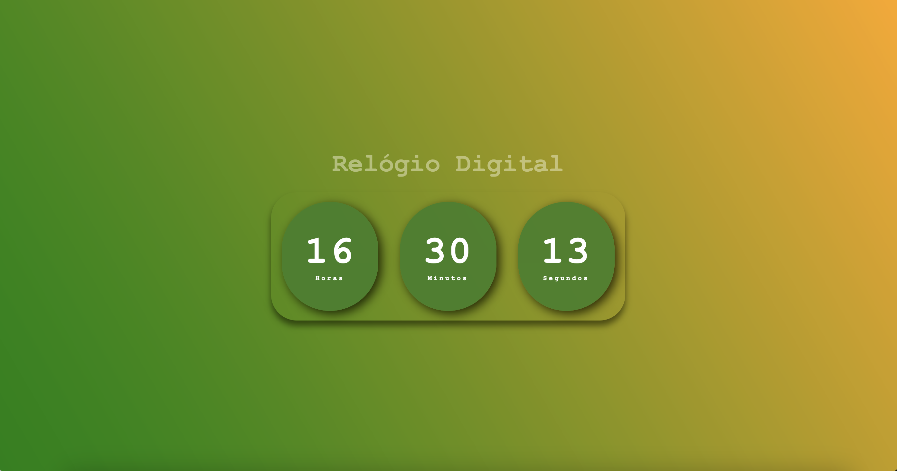

# Projeto "Relógio Digital"

O projeto foi desenvolvido como forma de prática dos conceitos básicos de HTML, CSS e JavaScript.

### Acesse o projeto em funcionamento pelo link: https://isaias30silva.github.io/RELOGIO_DIGITAL/

Projeto original: Larissa Kich

https://www.youtube.com/watch?v=GK0ok3ZCXwM
